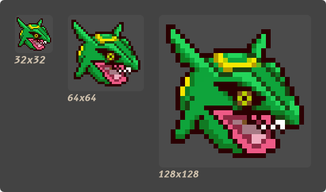
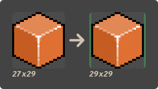

# IconPie

[](https://crates.io/crates/icon-pie)
[](https://github.com/rust-random/rand#rust-version-requirements)

A simple command-line tool that generates application icons from raster graphics or vector graphics images.

Quickly combine multiple images and create professional-looking icons for most versions of Windows, 
macOS, iOS & Linux.

Available as a single executable.

# Overview

An _icon_ consists of a set of _entries_. An _entry_ is simply an image that has a particular size.
For example, this is an icon that has a _32x32_ entry, a _64x64_ entry and a _128x128_ entry:



## What does it do?

Notice that, in the example above, most entries are basically the same picture re-scaled to 
multiple sizes. **IconPie** simply automates the process of re-scaling the picture and combining 
those re-scaled entries into an icon.

## How does it do it?

When re-scaling pictures, **IconPie** preserves it's original aspect ratio. It also ensures that 
the final entry is a square picture, by adding transparent borders if necessary.



**IconPie** uses 
_[nearest-neighbor interpolation](https://en.wikipedia.org/wiki/Nearest-neighbor_interpolation)_ 
for _[raster graphics](https://en.wikipedia.org/wiki/Raster_graphics)_ by default, optimizing for 
small-resolution images. Furthermore, when using _nearest-neighbor interpolation_, it only 
up-scales images on an integer scale, preserving as much detail as possible.


You can choose to opt-out of the default resampling scheme for _raster graphics_ by specifying a 
resampling filter with the `-r` flag, as described in the **[Usage](#Usage)** section.

**IconPie** _always_ uses _[linear interpolation](https://en.wikipedia.org/wiki/Linear_interpolation)_ 
for _[vector graphics](https://en.wikipedia.org/wiki/Vector_graphics)_, regardless of any specified 
resampling filter.

# Usage

The formal [`docopt`](http://docopt.org/) syntax for using **IconPie** is as follows:

```$ icon-pie ((-e <file path> <size>... [-r (nearest | linear | cubic)])... (-ico | -icns | -png) [<output path>]) | -h | --help | -v | --version```

* `-e <options>`          Specify an entry's options.
* `-r <filter>`           Specify a re-sampling filter: `nearest`, `linear` or `cubic`. If no filter is specified the app defaults to `nearest`.
* `-ico [<output path>]`  Outputs to an `.ico` file. If no output path is specified the app outputs to `stdout`.
* `-icns [<output path>]` Outputs to an `.icns` file. If no output path is specified the app outputs to `stdout`.
* `-png [<output path>]`  Outputs a `.png` sequence as a `.tar` file. If no output path is specified the app outputs to `stdout`.
* `-h`, `--help`          Help.
* `-v`, `--version`       Display version information.

## Examples

* `$ icon-pie -e small.svg 16 20 24 -e big.png 32 64 -ico output.ico`
* `$ icon-pie -e image.png 32 64 48 -r linear -png output.tar`
* `$ echo Here's an ICNS file: ${ icon-pie -e image.jpg 16 32 64 -r cubic -icns | hexdump }`

# Support

## Icon Formats

* `ICO`
* `ICNS`
* `PNG Sequence`

## Image Formats

| Format | Supported?                                                    | 
|--------|---------------------------------------------------------------| 
| `PNG`  | All supported color types                                     | 
| `JPEG` | Baseline and progressive                                      | 
| `GIF`  | Yes                                                           | 
| `BMP`  | Yes                                                           | 
| `ICO`  | Yes                                                           | 
| `TIFF` | Baseline(no fax support), `LZW`, PackBits                     | 
| `WEBP` | Lossy(Luma channel only)                                      | 
| `PNM ` | `PBM`, `PGM`, `PPM`, standard `PAM`                           |
| `SVG`  | [Limited](https://github.com/GarkGarcia/icon-pie#svg-support) |

## ICNS Support

| OSType | Description                             | Supported? |
|--------|-----------------------------------------|------------|
| `ICON` | 32×32 1-bit icon                        | No         |
| `ICN#` | 32×32 1-bit icon with 1-bit mask        | No         |
| `icm#` | 16×12 1-bit icon with 1-bit mask        | No         |
| `icm4` | 16×12 4-bit icon                        | No         |
| `icm8` | 16×12 8-bit icon                        | No         |
| `ics#` | 16×16 1-bit mask                        | No         |
| `ics4` | 16×16 4-bit icon                        | No         |
| `ics8` | 16x16 8-bit icon                        | No         |
| `is32` | 16×16 24-bit icon                       | Yes        |
| `s8mk` | 16x16 8-bit mask                        | Yes        |
| `icl4` | 32×32 4-bit icon                        | No         |
| `icl8` | 32×32 8-bit icon                        | No         |
| `il32` | 32x32 24-bit icon                       | Yes        |
| `l8mk` | 32×32 8-bit mask                        | Yes        |
| `ich#` | 48×48 1-bit mask                        | No         |
| `ich4` | 48×48 4-bit icon                        | No         |
| `ich8` | 48×48 8-bit icon                        | No         |
| `ih32` | 48×48 24-bit icon                       | Yes        |
| `h8mk` | 48×48 8-bit mask                        | Yes        |
| `it32` | 128×128 24-bit icon                     | Yes        |
| `t8mk` | 128×128 8-bit mask                      | Yes        |
| `icp4` | 16x16 32-bit PNG/JP2 icon               | PNG only   |
| `icp5` | 32x32 32-bit PNG/JP2 icon               | PNG only   |
| `icp6` | 64x64 32-bit PNG/JP2 icon               | PNG only   |
| `ic07` | 128x128 32-bit PNG/JP2 icon             | PNG only   |
| `ic08` | 256×256 32-bit PNG/JP2 icon             | PNG only   |
| `ic09` | 512×512 32-bit PNG/JP2 icon             | PNG only   |
| `ic10` | 512x512@2x "retina" 32-bit PNG/JP2 icon | PNG only   |
| `ic11` | 16x16@2x "retina" 32-bit PNG/JP2 icon   | PNG only   |
| `ic12` | 32x32@2x "retina" 32-bit PNG/JP2 icon   | PNG only   |
| `ic13` | 128x128@2x "retina" 32-bit PNG/JP2 icon | PNG only   |
| `ic14` | 256x256@2x "retina" 32-bit PNG/JP2 icon | PNG only   |

## SVG Support

**IconPie** uses the `nsvg` crate to rasterize `.svg` files. According to the authors of the crate:

> Like NanoSVG, the rasterizer only renders flat filled shapes. It is not particularly fast or accurate, but it is a simple way to bake vector graphics into textures.

The author of `icon-pie` is inclined to search for alternatives to `nsvg` if inquired to. Help would be appreciated.

# License

Licensed under MIT license([LICENSE-MIT](https://github.com/GarkGarcia/icon-pie/blob/master/LICENSE) or http://opensource.org/licenses/MIT).
