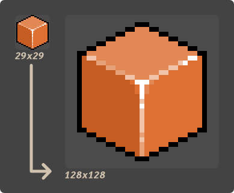

# IconPie

[](https://crates.io/crates/icon-pie)


A simple command-line tool to generate application icons from raster graphics or vector graphics images.

Quickly combine multiple images and create professional-looking icons for most versions of Windows, 
macOS, iOS & Linux. Powered by **[IconBaker](https://crates.io/crates/icon_baker)**.

# Features

* Simple interface.
* Sane defaults for the domain of icon composition.
* Supports outputting to `stdout`, allowing for piping.
* Available as a single executable.

# Overview

An _icon_ consists of a set of _entries_. An _entry_ is simply an image that has a particular size.
For example, this is an icon that has a _32x32_ entry, a _64x64_ entry and a _128x128_ entry:


## What does it do?

Notice that, in the example above, most entries are basically the same picture re-scaled to 
multiple sizes. **IconPie** simply automates the process of re-scaling the picture and combining 
those re-scaled entries into an icon.

## How does it do it?

### Re-scaling

When re-scaling pictures, **IconPie** preserves their original aspect-ratios. It also ensures that 
the all re-scaled images are square, by adding transparent borders if necessary. If the picture 
presents a transparent background, the transparency is preserved in the re-scaled images.


### Interpolation

For _[raster graphics](https://en.wikipedia.org/wiki/Raster_graphics)_ (`jpeg`, `png`, ...), **IconPie** 
uses _[nearest-neighbor interpolation](https://en.wikipedia.org/wiki/Nearest-neighbor_interpolation)_ 
by default, optimizing for small-resolution images.

Furthermore, when using _nearest-neighbor interpolation_, it only up-scales images on an integer 
scale, preserving as much detail as possible.



You can choose to opt-out of the default interpolation scheme for _raster graphics_ by specifying a 
resampling filter with the `-r` flag, as described in the **[Usage](#Usage)** section.

For _[vector graphics](https://en.wikipedia.org/wiki/Vector_graphics)_ (`svg`), 
**IconPie** _always_ uses _[linear interpolation](https://en.wikipedia.org/wiki/Linear_interpolation)_ 
regardless of any specified resampling filter. _Vector graphics_ are also rasterized with antialiasing.

# Usage

The formal [`docopt`](http://docopt.org/) syntax for using **IconPie** is as follows:

* `icon-pie icns ((-e | --entry) <file path> <size>... [(-r | --resample) (nearest | linear | cubic)])... [(-o | --output) <path>]`
* `icon-pie ico ((-e | --entry) <file path> <size>... [(-r | --resample) (nearest | linear | cubic)])... [(-o | --output) <path>]`
* `icon-pie favicon ((-e | --entry) <file path> <size>... [(-r | --resample) (nearest | linear | cubic)])... [--apple-touch] [--web-app] [(-o --output) <path>]`
* `icon-pie (-h | --help)`
* `icon-pie (-v | --version)`

## Options

* `-e FILE (SIZE)...`, `--entry FILE (SIZE)...` — Specify an entry's source image and target sizes.
* `-r FILTER`, `--resample FILTER` — Specify a re-sampling filter: `nearest`, `linear` or `cubic`. If no filter is specified
  the app defaults to `nearest`.
* `-o PATH`, `--output PATH` — Specify an output path. This is optional. If absent the output is directed to `stdout`.
* `--apple-touch` — Favicon specific option. Confire the output to include link tags for apple-touch icons in the HTML helper.
* `--web-app` — Favicon specific option. Confire the output to include a `.webmanifest` helper for
  [PWA icons](https://developer.mozilla.org/en-US/docs/Web/Progressive_web_apps/Installable_PWAs).
* `-h`, `--help` — Help.
* `-v`, `--version` — Display version information.

## Examples

Let's say you have the following files saved at your file system.


We'll walk trought some practical examples of **IconPie** usage.

### Simple Usage

> Take `big.svg`, resize it to _32x32_, _64x64_ and _128x128_. Then save it at `icon.ico`.

```
$ icon-pie ico -e big.svg 32 64 128 -o icon.ico
```


### Sampling From Multiple Files

> Take `small.png`, resize it to _32x32_ and _64x64_. Then take `big.svg` and resize it _128x128_. 
> Then combine the re-scaled entries in `icon.icns`.

```
$ icon-pie icns -e small.png 32 64 -e big.svg 128 -o icon.icns
```


### Specifying a Resampling Filter

> Take `small.png`, resize it to _32x32_ and _64x64_ **_using linear interpolation_**. Then take 
> `big.svg` and resize it _128x128_. Then combine the re-scaled entries into a _favicon_ scheme.

```
$ icon-pie favicon -e small.png 64 128 -r linear -o ./favicon/
```


`./favicon/helper.html`
```html
<link rel="icon" type="image/png" sizes="64x64" href="icons/favicon-0.png">
<link rel="icon" type="image/png" sizes="128x128" href="icons/favicon-1.png">
```

# Support

## Icon Formats

This are the icon formats **IconPie** can output to:

* `ico`
* `icns`
* _favicon_

### Icns Support

| OSType | Description                                  | Supported?   |
|--------|----------------------------------------------|--------------|
| `ICON` | 32×32 1-bit entry                            | No           |
| `ICN#` | 32×32 1-bit entry with 1-bit mask            | No           |
| `icm#` | 16×12 1-bit entry with 1-bit mask            | No           |
| `icm4` | 16×12 4-bit entry                            | No           |
| `icm8` | 16×12 8-bit entry                            | No           |
| `ics#` | 16×16 1-bit mask                             | No           |
| `ics4` | 16×16 4-bit entry                            | No           |
| `ics8` | 16x16 8-bit entry                            | No           |
| `is32` | 16×16 24-bit entry                           | Yes          |
| `s8mk` | 16x16 8-bit mask                             | Yes          |
| `icl4` | 32×32 4-bit entry                            | No           |
| `icl8` | 32×32 8-bit entry                            | No           |
| `il32` | 32x32 24-bit entry                           | Yes          |
| `l8mk` | 32×32 8-bit mask                             | Yes          |
| `ich#` | 48×48 1-bit mask                             | No           |
| `ich4` | 48×48 4-bit entry                            | No           |
| `ich8` | 48×48 8-bit entry                            | No           |
| `ih32` | 48×48 24-bit entry                           | Yes          |
| `h8mk` | 48×48 8-bit mask                             | Yes          |
| `it32` | 128×128 24-bit entry                         | Yes          |
| `t8mk` | 128×128 8-bit mask                           | Yes          |
| `icp4` | 16x16 32-bit `png`/`jp2` entry               | `png` only   |
| `icp5` | 32x32 32-bit `png`/`jp2` entry               | `png` only   |
| `icp6` | 64x64 32-bit `png`/`jp2` entry               | `png` only   |
| `ic07` | 128x128 32-bit `png`/`jp2` entry             | `png` only   |
| `ic08` | 256×256 32-bit `png`/`jp2` entry             | `png` only   |
| `ic09` | 512×512 32-bit `png`/`jp2` entry             | `png` only   |
| `ic10` | 512x512@2x "retina" 32-bit `png`/`jp2` entry | `png` only   |
| `ic11` | 16x16@2x "retina" 32-bit `png`/`jp2` entry   | `png` only   |
| `ic12` | 32x32@2x "retina" 32-bit `png`/`jp2` entry   | `png` only   |
| `ic13` | 128x128@2x "retina" 32-bit `png`/`jp2` entry | `png` only   |
| `ic14` | 256x256@2x "retina" 32-bit `png`/`jp2` entry | `png` only   |

## Image Formats

This are the formats **IconPie** can use as input:

| Format | Supported?                                                             |
|--------|------------------------------------------------------------------------|
| `png`  | All supported color types                                              |
| `jpeg` | Baseline and progressive                                               |
| `gif`  | Yes                                                                    |
| `bmp`  | Yes                                                                    |
| `ico`  | Yes                                                                    |
| `tiff` | Baseline(no fax support), `lzw`, PackBits                              |
| `webp` | Lossy(Luma channel only)                                               |
| `pnm ` | `pbm`, `pgm`, `ppm`, standard `pma`                                    |
| `svg`  | [Static SVG Full 1.1](https://github.com/RazrFalcon/resvg#svg-support) |

# License

Licensed under MIT license([LICENSE-MIT](https://github.com/GarkGarcia/icon-pie/blob/master/LICENSE) 
or http://opensource.org/licenses/MIT).

# Contribution

Unless you explicitly state otherwise, any contribution intentionally submitted for inclusion in the 
work by you shall be licensed as above, without any additional terms or conditions.

Feel free to help out! Contributions are welcomed 😃
